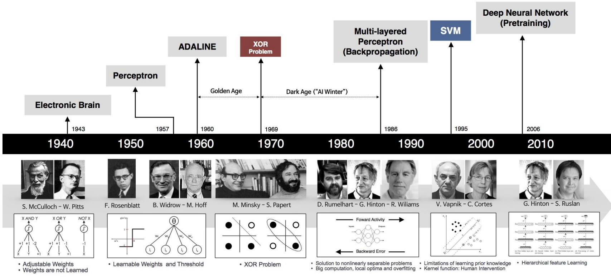

### ¡Bienvenidos al Curso!

-   👤 Jefferson Rodríguez, Colombiano.
-   💼 Ingeniero en Sistemas, MSc en Ciencias de la Computación, actualmente doctorando en Deep Learning y Ciberseguridad en la Universidad de Cagliari. Experiencia en ciencia de datos, Visión por computadora, biometría, esteganografía y watermarking
-   🎯 Mi intención es contribuir con el desarrollo de su formación en esta maestría y ser una apoyo para su proyectos de grado.

------------------------------------------------------------------------

### ¿Qué es Deep Learning? (En pocas palabras)

-   Una forma avanzada de inteligencia artificial que aprende a partir de grandes volúmenes de datos.
-   Permite a las computadoras aprender de datos con modelos inspirados en el cerebro.
-   Clave para entender patrones complejos en información no estructurada (imágenes, sonido, texto).
-   Se basa en el paradigma de programación diferenciable (differentiable programming).

------------------------------------------------------------------------

### ¿Cómo se conecta con otras áreas? y su evolución

::: small
-   Inteligencia Artificial (IA) ⟶ Aprendizaje Automático (ML) ⟶ Deep Learning (DL)
:::

::: fragment
{width="100%" height="400px"}
:::

------------------------------------------------------------------------

### ¿En qué se diferencia de Machine Learning?

{width="100%" height="500px"}

------------------------------------------------------------------------

### ¿Por qué Deep Learning HOY? Su Importancia.

-   Impulsa la **innovación** en múltiples industrias (salud, finanzas, automoción, entretenimiento...).
-   Permite **automatización** y **análisis de datos a gran escala**.
-   Base de productos y servicios que usamos a diario (reconocimiento facial, asistentes de voz, recomendaciones personalizadas).
-   **¡Transforma datos en soluciones!**

------------------------------------------------------------------------

### ¿Qué está pasando hoy con DL?

-   Modelos con miles de millones de parámetros.
-   Entrenamiento en miles de GPUs.
-   Costos de entrenamiento millonarios (pero también acceso gratuito gracias al open source).
-   Resultados sorprendentes: DALL·E, GPT, Stable Diffusion.
-   **¡No siempre necesitas ser masivo! DL también funciona en casos comunes.**

------------------------------------------------------------------------

### Avances Recientes Impresionantes

-   Modelos generativos (texto, imagen, música): ChatGPT, DALL·E, Midjourney.
-   Vehículos autónomos (Tesla, Waymo).
-   Diagnóstico médico asistido por IA (detección de cáncer, retinopatía).
-   Traducción y reconocimiento de voz en tiempo real.

------------------------------------------------------------------------

### Nuestro Viaje en 3 Semanas: La Hoja de Ruta

-   **Semana 1:** Fundamentos (Perceptrón, MLP, Entrenamiento básico, Tu primer proyecto práctico).

-   **Semana 2:** Arquitecturas Especializadas (CNNs, RNNs, etc.) y sus aplicaciones prácticas.

-   **Semana 3:** Temas Avanzados (Transfer Learning, Modelos Fundacionales, Ética del DL, Proyecto Final).

-   **Enfoque PRÁCTICO:** Cada semana, ¡manos a la obra con código y ejercicios!

-   [Ir a las Diapositivas de la Semana 1](../semana_1/slides/slides_semana_1.html)