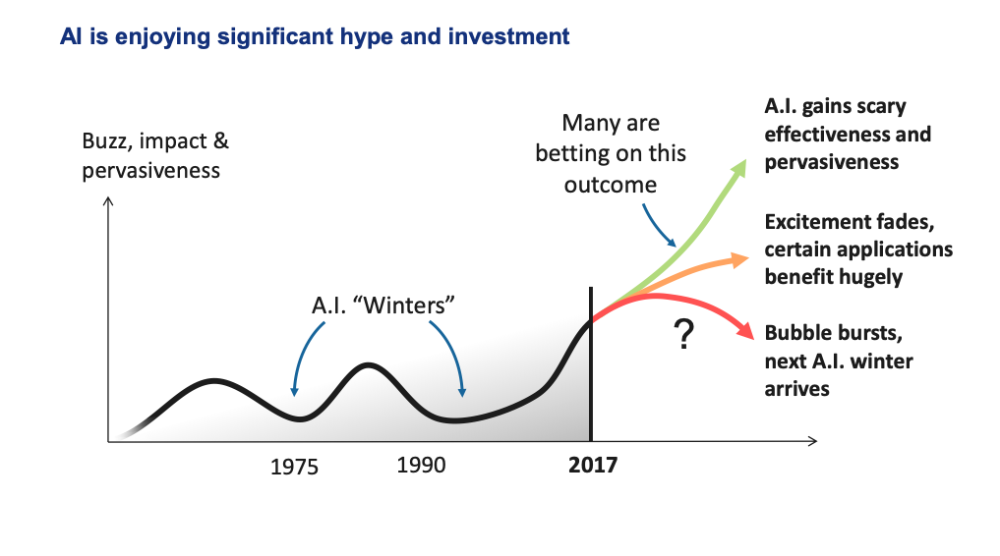
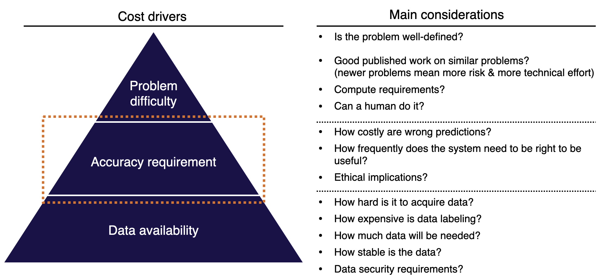
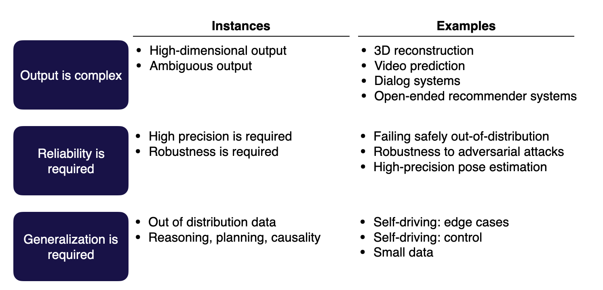
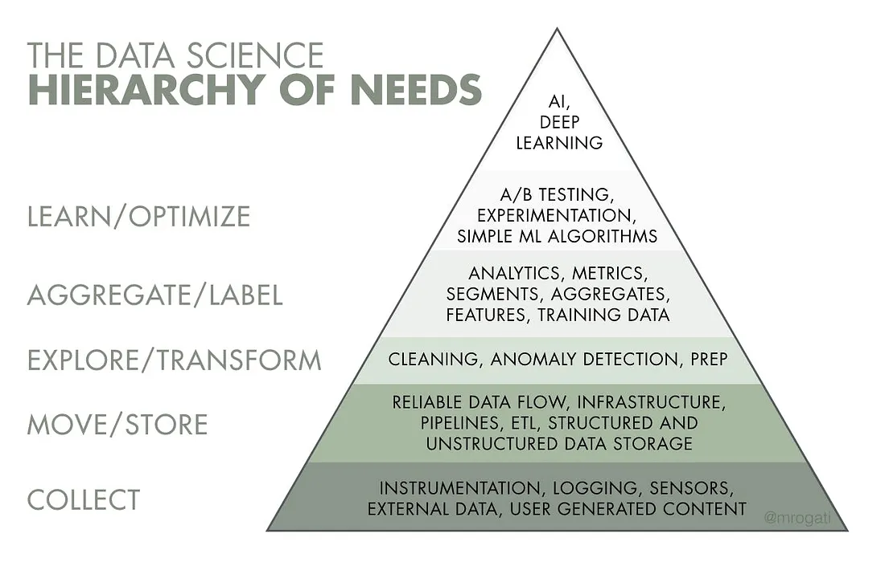
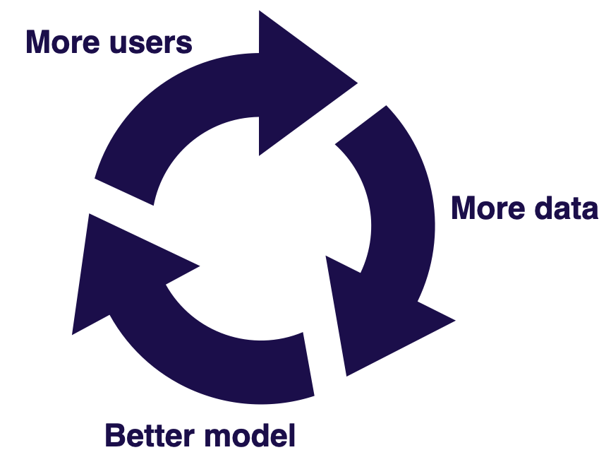
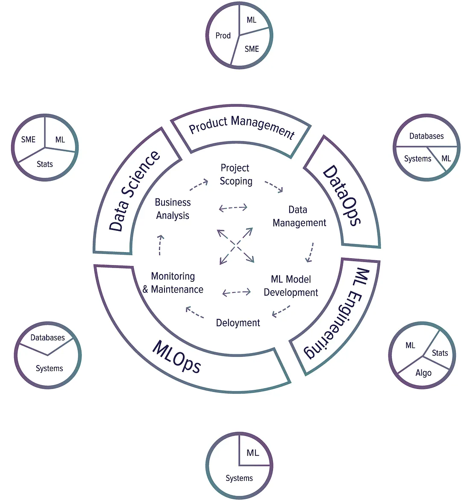
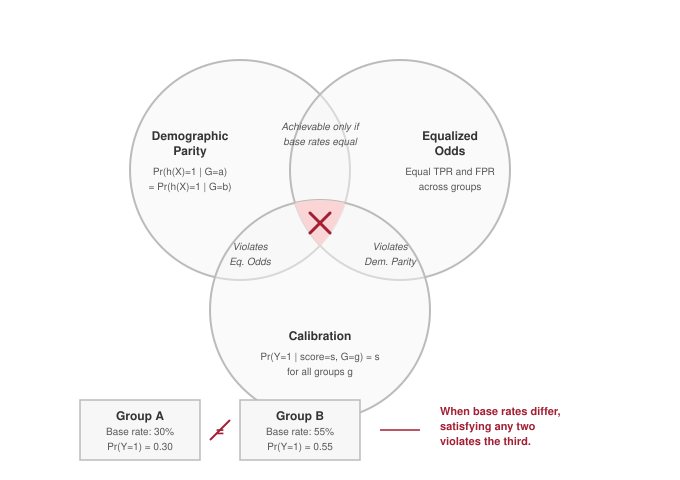

### ¿Qué es Deep Learning? (En pocas palabras)

-   Una forma avanzada de inteligencia artificial que aprende a partir de grandes volúmenes de datos.
-   Permite a las computadoras aprender de datos con modelos inspirados en el cerebro.
-   Clave para entender patrones complejos en información no estructurada (imágenes, sonido, texto).
-   Se basa en el paradigma de programación diferenciable (differentiable programming).

------------------------------------------------------------------------

### ¿Cómo se conecta con otras áreas? y su evolución

::: small
-   Inteligencia Artificial (IA) ⟶ Aprendizaje Automático (ML) ⟶ Deep Learning (DL)
:::

::: fragment
{width="100%"}
:::

------------------------------------------------------------------------

### ¿En qué se diferencia de Machine Learning?

{width="100%"}

------------------------------------------------------------------------

### ¿Por qué Deep Learning HOY? Su Importancia.

-   Impulsa la **innovación** en múltiples industrias (salud, finanzas, automoción, entretenimiento...).
-   Permite **automatización** y **análisis de datos a gran escala**.
-   Base de productos y servicios que usamos a diario (reconocimiento facial, asistentes de voz, recomendaciones personalizadas).
-   **¡Transforma datos en soluciones!**

------------------------------------------------------------------------

### ¿Qué está pasando hoy con DL?

-   Modelos con miles de millones de parámetros.
-   Entrenamiento en miles de GPUs.
-   Costos de entrenamiento millonarios (pero también acceso gratuito gracias al open source).
-   Resultados sorprendentes: DALL·E, GPT, Stable Diffusion.
-   **¡No siempre necesitas ser masivo! DL también funciona en casos comunes.**

------------------------------------------------------------------------

### Avances Recientes Impresionantes

-   Modelos generativos (texto, imagen, música): ChatGPT, DALL·E, Midjourney.
-   Vehículos autónomos (Tesla, Waymo).
-   Diagnóstico médico asistido por IA (detección de cáncer, retinopatía).
-   Traducción y reconocimiento de voz en tiempo real.

------------------------------------------------------------------------

::::::::::::::::::::::::::::::::::::::::::: {.content-hidden .solo-base-montevideo when-profile="uide-ds,uide-dl"}
# Estructuración de Proyectos de Deep Learning {background-color="#1a3a5c"}

------------------------------------------------------------------------

### ¿De qué trata esta lección?

**Mensaje central:** un buen proyecto de Deep Learning no es solo un modelo entrenado. Es un sistema listo para producción que conecta datos, algoritmos, infraestructura, evaluación, usuarios, monitoreo y valor de negocio.

**Objetivo:** entender cuándo conviene usar DL, cómo elegir proyectos de alto impacto y costo viable, y cómo estructurar el ciclo de vida completo de un proyecto.

::: notes
Fuente: Tobin, Le & Rachakonda, FSDL Lecture 1: Course Vision and When to Use ML, pp. 1-5; Huyen, Designing Machine Learning Systems, Cap. 1, pp. 5-8.
:::

------------------------------------------------------------------------

### ¿Por qué existe esta lección?

-   Los productos con IA ya son parte del mainstream, y entrenar un modelo es cada vez más accesible (modelos preentrenados, AutoML, APIs, frameworks estandarizados).
-   Lo difícil ya no es solo entrenar un modelo: es traducir avances de investigación en productos reales.
-   Muchos proyectos de ML/DL fracasan antes de empezar: son técnicamente inviables, están mal definidos, nunca llegan a producción, no tienen criterios de éxito compartidos, o resuelven un problema que no vale la complejidad que introducen.

{width="70%"}

{width="65%"}

{width="65%"}

::: fragment
El valor de un proyecto de ML debe superar no solo su costo de desarrollo, sino también la complejidad adicional que agrega al sistema de software.
:::

::: notes
Fuente: Tobin, Le & Rachakonda, FSDL Lecture 1, pp. 2-5, 9-10
:::

------------------------------------------------------------------------

### De pensar en modelos a pensar en sistemas

-   Un algoritmo de machine learning es solo una pequeña parte de un sistema de ML en producción.
-   Un sistema en producción también incluye la interfaz de usuario/desarrollador, el stack de datos, el hardware, y la infraestructura de desarrollo, despliegue, monitoreo y actualización.
-   Enfocarse solo en el algoritmo no alcanza para un sistema en producción.

{width="75%"}

::: notes
Fuente: Huyen, Designing Machine Learning Systems, Cap. 1, pp. 6-8.
:::

------------------------------------------------------------------------

### ¿Qué problema intenta resolver el Machine Learning?

El machine learning es un enfoque para:

::: nonincremental
1.  Aprender
2.  patrones complejos
3.  a partir de datos existentes
4.  para hacer predicciones
5.  sobre datos nuevos (no vistos).
:::

Un problema es más adecuado para ML cuando estas condiciones tienen sentido para la aplicación.

::: notes
Fuente: Huyen, Cap. 1, pp. 9-13.
:::

------------------------------------------------------------------------

### ¿Cuándo usar (y cuándo NO usar) ML/DL?

::: nonincremental
**ML/DL suele brillar cuando:**

-   la tarea es repetitiva;
-   el costo de una predicción equivocada es bajo o manejable;
-   el problema ocurre a gran escala;
-   los patrones cambian con el tiempo y las reglas fijas quedan obsoletas.
:::

::: {.fragment .nonincremental}
**Evitar ML/DL cuando:**

-   el caso de uso no es ético;
-   soluciones más simples ya resuelven el problema lo suficientemente bien;
-   la solución no es costo-efectiva.
:::

Si el ML no puede resolver todo el problema, puede resolver una parte más pequeña de él.

::: notes
Fuente: Huyen, Cap. 1, pp. 13-15; Tobin, Le & Rachakonda, FSDL Lecture 1, pp. 9-10.
:::

------------------------------------------------------------------------

### Antes de empezar: 3 preguntas y un checklist de viabilidad

::: nonincremental
1.  **¿Estamos listos para usar ML?** ¿Tenemos un producto, una recolección de datos usable, almacenamiento sano y las personas correctas?
2.  **¿Realmente necesitamos ML?** ¿Ya probamos reglas, estadística simple o líneas base más sencillas?
3.  **¿Es ético usar ML para este problema?**
:::

::: {.fragment .nonincremental}
**Checklist rápido de viabilidad:**

-   Confirma que el ML realmente es necesario.
-   Define criterios de éxito con todos los interesados.
-   Considera la ética de usar ML.
-   Haz una revisión de literatura.
-   Construye rápido un dataset etiquetado de referencia.
-   Construye un modelo mínimo viable con reglas o heurísticas simples.
-   Vuelve a preguntarte: "¿de verdad necesitamos ML?"
:::

::: notes
Fuente: Tobin, Le & Rachakonda, FSDL Lecture 1, pp. 9-10, 14
:::

------------------------------------------------------------------------

### Selección de proyectos: impacto vs. viabilidad

Prioriza casos de uso con:

::: nonincremental
-   **Alto impacto:** fricción en el producto, partes complejas del pipeline, lugares donde una predicción barata es valiosa, o patrones ya validados por la industria.
-   **Alta viabilidad / bajo costo:** datos disponibles, errores tolerables, y dificultad manejable del problema.
:::

{width="65%"}

::: notes
Fuente: Tobin, Le & Rachakonda, FSDL Lecture 1, pp. 10-12
:::

------------------------------------------------------------------------

### ¿Qué hace a un proyecto de alto impacto y bajo costo?

::: nonincremental
**Alto impacto:**

-   Busca problemas donde predecir más barato cambie lo que es económicamente viable.
-   Identifica qué necesita el producto.
-   Busca comportamientos complejos definidos manualmente que puedan volverse "Software 2.0".
-   Estudia qué hacen otros equipos de la industria (papers, blogs técnicos).
:::

::: {.fragment .nonincremental}
**Bajo costo (viabilidad):**

-   **Datos:** adquisición, costo de etiquetado, volumen, estabilidad, seguridad.
-   **Precisión exigida:** costo de una predicción errónea, umbral útil, consecuencias éticas.
-   **Dificultad del problema:** qué tan bien definido está, si existe trabajo previo, cuánto cómputo se necesita.
:::

{width="55%"}

El costo de un proyecto de ML tiende a escalar más que linealmente con la exigencia de precisión.

::: notes
Fuente: Tobin, Le & Rachakonda, FSDL Lecture 1, pp. 11-13
:::

------------------------------------------------------------------------

### ¿Qué hace que el ML sea difícil?

Tres razones por las que el ML puede ser especialmente difícil:

::: nonincremental
1.  **Salidas complejas o ambiguas.**
2.  **Necesidad de alta confiabilidad** — los sistemas de ML pueden fallar de forma inesperada.
3.  **Necesidad de generalizar** fuera de la distribución de entrenamiento (razonamiento, planeación, causalidad).
:::

{width="55%"}

::: notes
Fuente: Tobin, Le & Rachakonda, FSDL Lecture 1, pp. 13-14.
:::

------------------------------------------------------------------------

### Arquetipos de producto de ML

::: nonincremental
| Arquetipo | Definición | Pregunta clave |
|------------------------|------------------------|------------------------|
| **Software 2.0** | Usar ML para potenciar automatización que el software/producto ya hace | ¿El modelo es realmente mejor que el sistema anterior? |
| **Humano en el ciclo** | Usar ML para complementar el juicio humano en tareas no totalmente automatizadas | ¿Qué tan bueno debe ser el sistema para mejorar el trabajo del usuario? |
| **Sistemas autónomos** | Usar ML para implementar procesos sin intervención humana | ¿Qué tasa de fallos es aceptable, y cómo se monitorean? |
:::

{width="60%"}

```{=html}
{width=60%}
```

::: fragment
**El volante de datos (data flywheel):** en arquitecturas Software 2.0, el modelo mejora → el producto mejora → más usuarios lo usan → se genera más data útil → la nueva data vuelve a mejorar el modelo. Pregúntate: ¿tenemos un ciclo de datos etiquetados escalable?
:::

{width="55%"}

::: notes
Fuente: Tobin, Le & Rachakonda, FSDL Lecture 1, pp. 14-17
:::

------------------------------------------------------------------------

### ML de investigación vs. ML de producción

::: nonincremental
| Dimensión | ML de investigación | ML de producción |
|------------------------|------------------------|------------------------|
| Requisitos | Desempeño de punta en datasets de benchmark | Distintos interesados, distintos requisitos |
| Prioridad computacional | Entrenamiento rápido, alto throughput | Inferencia rápida, baja latencia |
| Datos | Estáticos | Cambian constantemente |
| Equidad (fairness) | Frecuentemente "bueno tenerlo" | Importante |
| Interpretabilidad | Frecuentemente "bueno tenerlo" | Importante |
:::

::: notes
Fuente: Huyen, Cap. 1, pp. 19-28 (incluye la idea de la Data Science Hierarchy of Needs).
:::

------------------------------------------------------------------------

### El ciclo de vida de un proyecto de DL

Un sistema de ML en producción se desarrolla mediante un ciclo con idas y vueltas entre etapas:

::: nonincremental
1.  Alcance del proyecto (scoping)
2.  Ingeniería de datos
3.  Desarrollo del modelo
4.  Despliegue
5.  Monitoreo y aprendizaje continuo
6.  Análisis de negocio
:::

{width="70%"}

```{=html}
{width=70%}
```

Cada etapa retroalimenta a las anteriores: el desempeño del modelo se degrada después del despliegue. A diferencia del software tradicional, que suele degradarse cuando cambia el código, el ML puede degradarse cuando **el mundo cambia**. El despliegue es el inicio del ciclo de retroalimentación, no el final.

::: fragment
Dentro de este ciclo conviven dos pipelines conectados: uno de **datos** (recolección, ingesta, curación, etiquetado, validación) y uno de **modelo** (entrenamiento, evaluación, validación del sistema, despliegue). Los caminos de retroalimentación devuelven la experiencia de producción a la recolección y curación de datos.
:::

::: notes
Fuente: Huyen, Cap. 1, pp. 33-35; Reddi, Introduction to Machine Learning Systems, Cap. 3, pp. 84-86, 111.
:::

------------------------------------------------------------------------

### De los pesos al sistema reproducible

**Una falla real:** un equipo entrena un modelo de diagnóstico y logra alta precisión en test. Al desplegarlo, los ingenieros descubren que el modelo necesita más memoria de la que tiene el dispositivo objetivo. La precisión era excelente, las habilidades de ML eran excelentes — la falla fue de **flujo de trabajo**.

::: fragment
Un flujo de trabajo maduro entrega un artefacto de sistema reproducible, no solo pesos entrenados:
:::

::: {.fragment .nonincremental}
-   pesos del modelo;
-   código de inferencia, incluyendo preprocesamiento;
-   especificación del entorno (dependencias, contenedor, drivers);
-   configuración, hiperparámetros y ajustes de runtime.
:::

En ML, un desajuste de dependencias o preprocesamiento puede no tumbar el sistema — puede simplemente **desplazar en silencio** la distribución de las salidas.

::: notes
Fuente: Reddi, Introduction to Machine Learning Systems, Cap. 3, pp. 84, 99.
:::

------------------------------------------------------------------------

### Evaluación y mantenimiento en producción

::: nonincremental
**Evaluación más allá del accuracy:**

-   KPIs del modelo y qué tan listo está para desplegarse.
-   Latencia de inferencia, huella de memoria, costo de servir el modelo.
-   Comportamiento en umbrales específicos, no solo métricas agregadas.
-   Robustez ante distribuciones de datos cambiantes.
:::

::: {.fragment .nonincremental}
**Mantenimiento — el despliegue no es el final:**

-   El desempeño puede decaer y los requisitos pueden cambiar.
-   Los datos en producción pueden alejarse de los de entrenamiento.
-   El reentrenamiento y la validación son problemas recurrentes de ingeniería y presupuesto.
:::

Un modelo con excelente desempeño en benchmark puede seguir siendo inadecuado para producción si viola restricciones operativas.

::: notes
Fuente: Huyen, Cap. 1, pp. 25-35, Cap. 8; Reddi, Cap. 3, pp. 84-86, 99, 111.
:::

------------------------------------------------------------------------

### Costo total de propiedad (TCO) de un sistema de ML

Un sistema de ML tiene un costo de ciclo de vida completo, no solo un costo de entrenamiento.

{width="65%"}

Un error común es tratar la factura inicial de entrenamiento como el principal riesgo financiero; la deuda de datos y el mantenimiento pueden hacer que un modelo preciso sea económicamente insostenible.

::: notes
Fuente: Reddi, Machine Learning Systems at Scale, Cap. 12, pp. 715-716.
:::

------------------------------------------------------------------------

### IA responsable como parte del ciclo de vida

Los principios de IA responsable deben integrarse en todo el ciclo de vida:

::: nonincremental
-   equidad (fairness);
-   explicabilidad;
-   transparencia;
-   privacidad;
-   rendición de cuentas (accountability);
-   robustez.
:::

{width="70%"}

Estos principios crean obligaciones de ingeniería en la recolección de datos, el entrenamiento, la evaluación, el despliegue y el monitoreo. La IA responsable es un compromiso arquitectónico en todas las fases, no un paso de cumplimiento posterior.

::: notes
Fuente: Reddi, Machine Learning Systems at Scale, Cap. 16, pp. 936-938.
:::

------------------------------------------------------------------------

### Canvas práctico de estructuración de proyectos

Para cualquier proyecto de DL propuesto, documenta:

::: nonincremental
1.  Problema y fricción del usuario/producto.
2.  Por qué predecir es valioso aquí.
3.  Por qué reglas o estadística simple no bastan.
4.  Disponibilidad de datos, costo de etiquetado, estabilidad, seguridad.
5.  Interesados y criterios de éxito.
6.  Arquetipo de producto: Software 2.0, humano en el ciclo, o autónomo.
7.  Requisitos de precisión, latencia, memoria, costo y confiabilidad.
8.  Plan de ciclo de vida: pipeline de datos, pipeline de modelo, despliegue, monitoreo, reentrenamiento, análisis de negocio.
9.  Restricciones de IA responsable: equidad, explicabilidad, privacidad, rendición de cuentas, robustez.
:::

::: notes
Fuente: Tobin, Le & Rachakonda, FSDL Lecture 1, pp. 9-17; Huyen, Cap. 1, pp. 9-35; Reddi, Cap. 3, pp. 84-111; Reddi, Machine Learning Systems at Scale, Cap. 16, pp. 936-938.
:::

------------------------------------------------------------------------

### Ideas clave

::: nonincremental
-   El ML/DL agrega complejidad; úsalo solo cuando el valor la justifique.
-   Un modelo es solo un componente de un sistema de ML en producción.
-   Prioriza proyectos de alto impacto y viabilidad razonable.
-   Estructura los proyectos alrededor de los datos, el contexto de producto, las restricciones de despliegue y los ciclos de retroalimentación.
-   La evaluación debe incluir qué tan listo está para producción, no solo el desempeño en benchmark.
-   El despliegue inicia el ciclo de monitoreo, reentrenamiento y mantenimiento.
-   La responsabilidad y la ética deben diseñarse dentro del ciclo de vida, no agregarse después.
:::

::: notes
Fuente: Tobin, Le & Rachakonda, FSDL Lecture 1, pp. 9-17; Huyen, Cap. 1, pp. 6-35; Reddi, Cap. 3, pp. 84-111; Reddi, Machine Learning Systems at Scale, Cap. 12 y 16.
:::
:::::::::::::::::::::::::::::::::::::::::::

------------------------------------------------------------------------

### Pregunta guía

Antes de empezar Semana 1, piensa: ¿qué necesitas definir de tu proyecto de Deep Learning *antes* de escribir la primera línea de código?