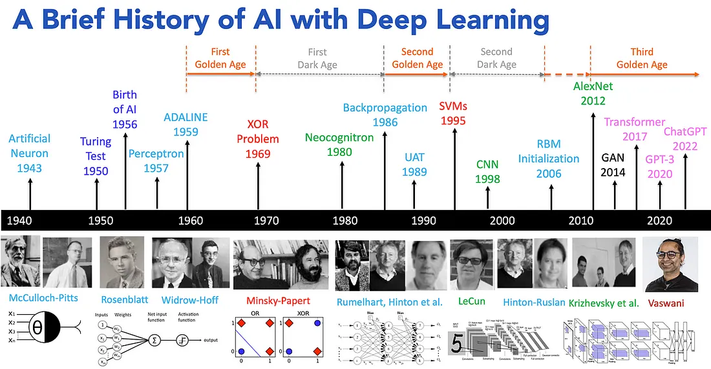
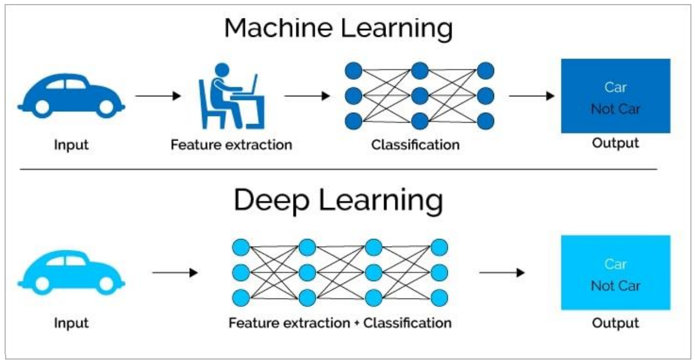
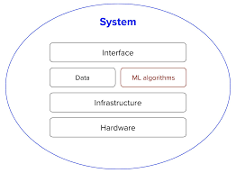
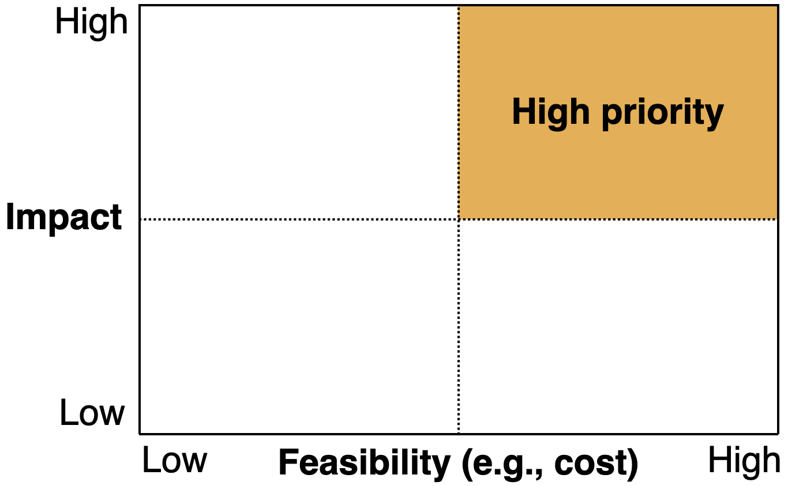
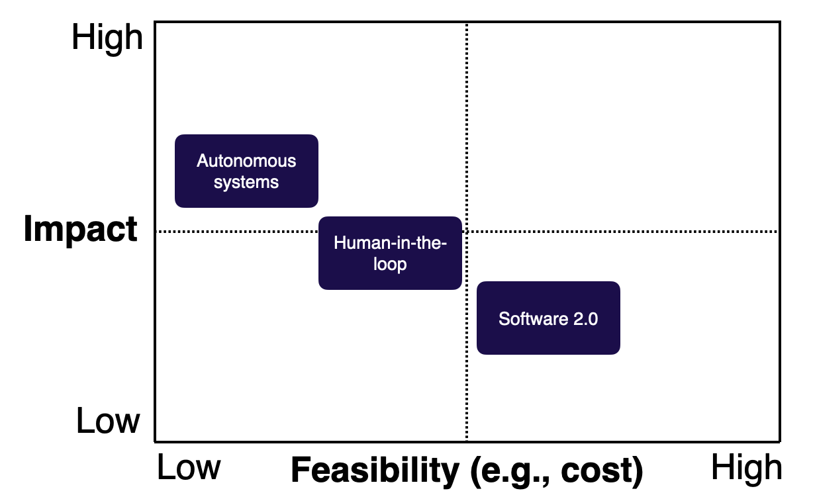
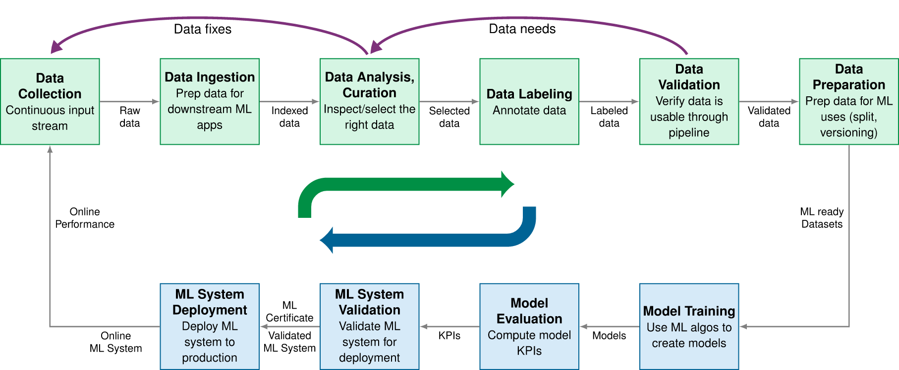
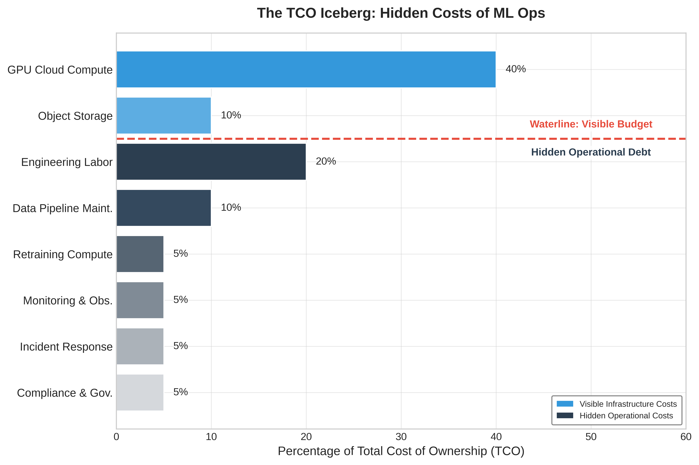
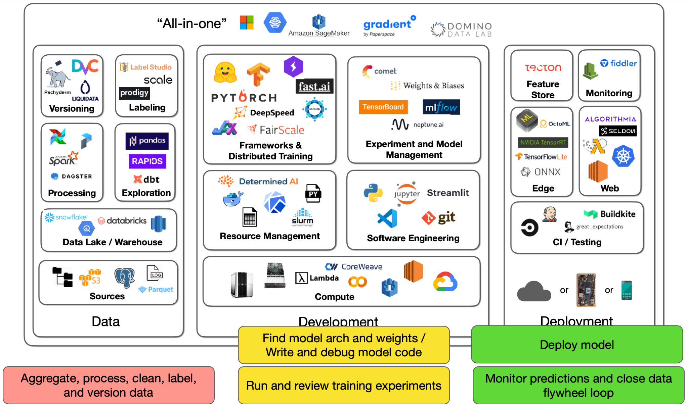
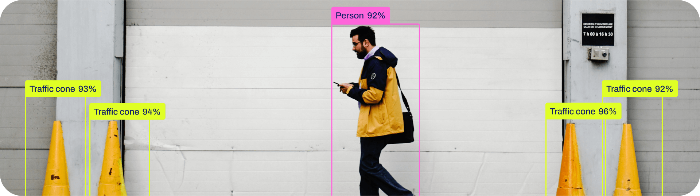

### ¿Qué es Deep Learning? (En pocas palabras)

-   Una forma avanzada de inteligencia artificial que aprende a partir de grandes volúmenes de datos.
-   Permite a las computadoras aprender de datos con modelos inspirados en el cerebro.
-   Clave para entender patrones complejos en información no estructurada (imágenes, sonido, texto).
-   Se basa en el paradigma de programación diferenciable (differentiable programming).

------------------------------------------------------------------------

### ¿Cómo se conecta con otras áreas? y su evolución

::: small
-   Inteligencia Artificial ⟶ Aprendizaje Automático ⟶ Deep Learning
:::

::: fragment
{width="100%"}
:::

------------------------------------------------------------------------

### ¿En qué se diferencia de Machine Learning?

{width="100%"}

------------------------------------------------------------------------

### ¿Por qué Deep Learning HOY? Su Importancia.

-   Impulsa la **innovación** en múltiples industrias (salud, finanzas, automoción, entretenimiento...).
-   Permite **automatización** y **análisis de datos a gran escala**.
-   Base de productos y servicios que usamos a diario (reconocimiento facial, asistentes de voz, recomendaciones personalizadas).
-   **¡Transforma datos en soluciones!**

------------------------------------------------------------------------

### ¿Qué está pasando hoy con DL?

-   Modelos con miles de millones de parámetros.
-   Entrenamiento en miles de GPUs.
-   Costos de entrenamiento millonarios (pero también acceso gratuito gracias al open source).
-   Resultados sorprendentes: DALL·E, GPT, Stable Diffusion.
-   **¡No siempre necesitas ser masivo! DL también funciona en casos comunes.**

------------------------------------------------------------------------

### Avances Recientes Impresionantes

-   Modelos generativos (texto, imagen, música): ChatGPT, DALL·E, Midjourney.
-   Vehículos autónomos (Tesla, Waymo).
-   Diagnóstico médico asistido por IA (detección de cáncer, retinopatía).
-   Traducción y reconocimiento de voz en tiempo real.
-   Agentes de IA

::::::::::::::::::::::::::::::::::::::::::: {.content-hidden .solo-base-montevideo when-profile="uide-ds,uide-dl"}
# Estructuración de Proyectos de Deep Learning

------------------------------------------------------------------------

### ¿De qué trata esta lección?

- **Mensaje central:** un buen proyecto de Deep Learning no es solo un modelo entrenado. Es un sistema listo para producción que conecta datos, algoritmos, infraestructura, evaluación, usuarios, monitoreo y valor de negocio.

- **Objetivo:** entender cuándo conviene usar DL, cómo elegir proyectos de alto impacto y costo viable, y cómo estructurar el ciclo de vida completo de un proyecto.

::: notes
Fuente: Tobin, Le & Rachakonda, FSDL Lecture 1: Course Vision and When to Use ML, pp. 1-5; Huyen, Designing Machine Learning Systems, Cap. 1, pp. 5-8.
:::

------------------------------------------------------------------------

### ¿Por qué existe esta lección?

-   Los productos con IA ya son parte del mainstream, y entrenar un modelo es cada vez más accesible (modelos preentrenados, AutoML, APIs, frameworks estandarizados).
-   Lo difícil ya no es solo entrenar un modelo: es traducir avances de investigación en productos reales.
-   Muchos proyectos de ML/DL fracasan antes de empezar: son técnicamente inviables, están mal definidos, nunca llegan a producción, no tienen criterios de éxito compartidos, o resuelven un problema que no vale la complejidad que introducen.

------------------------------------------------------------------------
### Pensar en modelo vs Pensar en producto

  Fuente: Tobin, Le & Rachakonda, FSDL Lecture 1, pp. 2-5, 9-10.

::: {.fragment}
El valor de un proyecto de ML debe superar no solo su costo de desarrollo, sino también la complejidad adicional que agrega al sistema de software.
:::

::: {.notes}
Fuente: Tobin, Le & Rachakonda, FSDL Lecture 1, pp. 2-5, 9-10
:::

------------------------------------------------------------------------

### Componentes de un sistema de ML en producción

{width="75%"}

-   Un algoritmo de machine learning es solo una pequeña parte de un sistema de ML en producción.
-   Un sistema en producción también incluye la interfaz de usuario/desarrollador, el stack de datos, el hardware, y la infraestructura de desarrollo, despliegue, monitoreo y actualización.
-   Enfocarse solo en el algoritmo no alcanza para un sistema en producción.

::: notes
Fuente: Huyen, Designing Machine Learning Systems, Cap. 1, pp. 6-8.
:::

------------------------------------------------------------------------

### ¿Cuándo usar (y cuándo NO usar) ML/DL?

::: nonincremental
**ML/DL suele brillar cuando:**

-   la tarea es repetitiva
-   el costo de una predicción equivocada es bajo o manejable
-   el problema ocurre a gran escala
-   los patrones cambian con el tiempo y las reglas fijas quedan obsoletas.
:::

::: {.fragment .nonincremental}
**Evitar ML/DL cuando:**

-   el caso de uso no es ético
-   soluciones más simples ya resuelven el problema lo suficientemente bien
-   la solución no es costo-efectiva.
:::

::: {.fragment .nonincremental}
Si el ML no puede resolver todo el problema, puede resolver una parte más pequeña de él.
:::

::: notes
Fuente: Huyen, Cap. 1, pp. 13-15; Tobin, Le & Rachakonda, FSDL Lecture 1, pp. 9-10.
:::

------------------------------------------------------------------------

### Selección de proyectos: impacto, viabilidad y bajo costo

  

  

  Fuente: Tobin, Le & Rachakonda, FSDL Lecture 1, pp. 10-13.

- **Alto impacto:** predicciones baratas que generan valor o reducen fricción.
- **Alta viabilidad / bajo costo:** datos disponibles, errores tolerables y precisión alcanzable.
- **Software 2.0:** reemplazar reglas manuales por comportamientos aprendidos.

::: {.notes}
Fuente: Tobin, Le & Rachakonda, FSDL Lecture 1, pp. 10-13.
:::
------------------------------------------------------------------------

### El ciclo de vida de un proyecto de DL

Un sistema de ML en producción se desarrolla mediante un ciclo con idas y vueltas entre etapas:

{width="70%"}

::: {.notes}
Cada etapa retroalimenta a las anteriores: el desempeño del modelo se degrada después del despliegue. A diferencia del software tradicional, que suele degradarse cuando cambia el código, el ML puede degradarse cuando **el mundo cambia**. El despliegue es el inicio del ciclo de retroalimentación, no el final.
:::

::: {.notes}
Dentro de este ciclo conviven dos pipelines conectados: uno de **datos** (recolección, ingesta, curación, etiquetado, validación) y uno de **modelo** (entrenamiento, evaluación, validación del sistema, despliegue). Los caminos de retroalimentación devuelven la experiencia de producción a la recolección y curación de datos.
:::

------------------------------------------------------------------------

### Evaluación y mantenimiento en producción

::: nonincremental
**Evaluación más allá del accuracy:**

-   KPIs del modelo y qué tan listo está para desplegarse.
-   Latencia de inferencia, huella de memoria, costo de servir el modelo.
-   Comportamiento en umbrales específicos, no solo métricas agregadas.
-   Robustez ante distribuciones de datos cambiantes.
:::

::: {.fragment .nonincremental}
**Mantenimiento — el despliegue no es el final:**

-   El desempeño puede decaer y los requisitos pueden cambiar.
-   Los datos en producción pueden alejarse de los de entrenamiento.
-   El reentrenamiento y la validación son problemas recurrentes de ingeniería y presupuesto.
:::

::: notes
Fuente: Huyen, Cap. 1, pp. 25-35, Cap. 8; Reddi, Cap. 3, pp. 84-86, 99, 111.
:::

------------------------------------------------------------------------

### Costo total de propiedad (TCO) de un sistema de ML

Un sistema de ML tiene un costo de ciclo de vida completo, no solo un costo de entrenamiento.

{width="65%"}

Un error común es tratar la factura inicial de entrenamiento como el principal riesgo financiero; la deuda de datos y el mantenimiento pueden hacer que un modelo preciso sea económicamente insostenible.

::: notes
Fuente: Reddi, Machine Learning Systems at Scale, Cap. 12, pp. 715-716.
:::

------------------------------------------------------------------------

### IA responsable como parte del ciclo de vida

Los principios de IA responsable deben integrarse en todo el ciclo de vida:

::: nonincremental
-   equidad (fairness);
-   explicabilidad;
-   transparencia;
-   privacidad;
-   rendición de cuentas (accountability);
-   robustez.
:::

La IA responsable es un compromiso arquitectónico en todas las fases, no un paso de cumplimiento posterior.

------------------------------------------------------------------------

### Herramientas en proyectos de Deep Learning

{width="100%"}

::: {.notes}
Usar esta slide para mostrar que un proyecto de Deep Learning no depende solo del modelo. También requiere herramientas para datos, experimentación, entrenamiento, seguimiento, despliegue, monitoreo y mantenimiento.
:::

------------------------------------------------------------------------

### En resúmen: Antes de empezar preguntar ¿vale la pena usar ML?

Antes de escribir código, responde:

1. **¿Estamos listos?** Producto, datos, almacenamiento y equipo adecuados.
2. **¿Realmente necesitamos ML?** Comparar contra reglas, heurísticas o estadística simple.
3. **¿Es ético usar ML aquí?** Evaluar riesgos, privacidad, sesgos y consecuencias.

::: {.fragment .nonincremental}
**Checklist mínimo:** criterios de éxito, dataset de referencia, línea base simple y revisión rápida de literatura.
:::

::: {.notes}
Fuente: Tobin, Le & Rachakonda, FSDL Lecture 1, pp. 9-10, 14.
:::

------------------------------------------------------------------------

### Canvas práctico del proyecto de DL

Documenta lo esencial:

- **Problema:** fricción del usuario/producto y valor de predecir.
- **Datos:** disponibilidad, etiquetado, estabilidad, seguridad y calidad.
- **Sistema:** tipo de producto, precisión, latencia, costo y confiabilidad.
- **Ciclo de vida:** despliegue, monitoreo, reentrenamiento y métricas de negocio.
- **Responsabilidad:** privacidad, equidad, explicabilidad, robustez y rendición de cuentas.

::: {.fragment}
**Pregunta guía:** ¿qué debes definir antes de entrenar el primer modelo?
:::

::: {.notes}
Fuente: Tobin, Le & Rachakonda, FSDL Lecture 1, pp. 9-17; Huyen, Cap. 1, pp. 9-35; Reddi, Cap. 3, pp. 84-111; Reddi, Machine Learning Systems at Scale, Cap. 16, pp. 936-938.
:::

------------------------------------------------------------------------

### Caso de uso: reconocimiento de objetos con Ultralytics

<iframe
  src="https://www.youtube.com/embed/N8TxB43y-xM?si=u10dq6Gb7Yj9Q1Bp"
  width="600"
  height="400"
  style="border:none; display:block; margin:0 auto;"
  allow="accelerometer; autoplay; clipboard-write; encrypted-media; gyroscope; picture-in-picture"
  allowfullscreen>
</iframe>

::: {.notes}
Usar esta slide para mostrar cómo los modelos de detección de objetos permiten localizar y clasificar objetos dentro de una imagen o video. Con Ultralytics/YOLO, el foco está en pasar rápidamente de un modelo entrenado a una aplicación usable: inferencia sobre imágenes, video o cámara, despliegue y experimentación práctica.
:::

------------------------------------------------------------------------

### Caso de uso: predictor de precio de una casa

<iframe
  src="https://poryectofinalpreciocasas.streamlit.app/?embed=true"
  width="900"
  height="500"
  style="border:none; display:block; margin:0 auto;"
  allowfullscreen>
</iframe>

::: {.fragment}

Aplicación interactiva para transformar datos de entrada en una predicción útil.

:::

# ¡Gracias!

**Preguntas y discusión**

 

Deep Learning en 3 Semanas  
Jefferson Rodríguez

